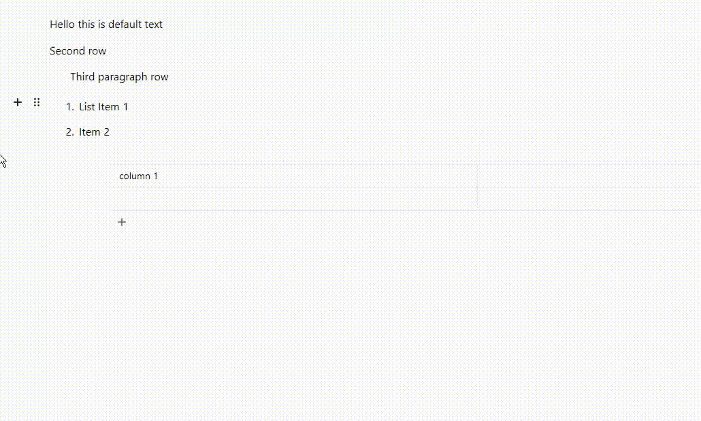

# EditorJS Indent Tune

Indent feature for [Editor.js](https://editorjs.io).



## Instalation

### Install via NPM

```shell
npm i editorjs-indent-tune
```

### Load from CDN

Require this script on a page with Editor.js.

```html
<script src="https://cdn.jsdelivr.net/npm/editorjs-indent-tune/dist/bundle.js"><script>
```

## Usage

```js
import EditorJS from '@editorjs/editorjs'
import IndentTune from 'editorjs-indent-tune'

/**
 * Editor.js configuration
 */
const editor = new EditorJS({
    /**
     * Connect tool
     */
    tools: {
        indentTune: {
                class: IndentTune,
                // recommended for version based style adjustments
                version: EditorJS.version,
            },
    },

    /**
     * Apply to all the blocks
     */
    tunes: ['indentTune'],

    // ...
})
```

You can disable this tune for a specific block by not adding it in the tunes array

```js
const editor = new EditorJS({
    tools: {
        someOtherTool: {
            //...
            tunes: [
                /* all other tunes except those you dont want*/
            ],
        },
    },
})
```

Apply a indent highlight

```css
.indentHighlight {
    transition: background-color 0.4s;
}
[data-block-indent-wrapper][data-focused] .indentHighlight {
    background-color: red;
}
```

```js
const editor = new EditorJS({
    tools: {
        indentTune: {
            class: IndentTune,
            config: {
                highlightIndent: {
                    className: 'indentHighlight',
                },
            },
        },
    },
})
```

Complete example:

```js
import IndentTune, { type IndentTuneConfig } from 'editorjs-indent-tune'

const editor = new EditorJS({
    tools: {

        someOtherBlock: {
            //...
        },
        indentTune: {
            class: IndentTune,
            config: {
                version: EditorJS.version,
                customBlockIndentLimits: {
                    someOtherBlock: { max: 5 },
                },
                maxIndent: 10,
                indentSize: 30,
                multiblock: true,
                tuneName: 'indentTune',
                // If you use typescript
            } as IndentTuneConfig,
        },
    },
})
```

### What if my editor also has a text alignment tune?

You can use the `directionChangeHandler` config field for that.

Here is one solution:

```ts
class MyAlignmentTuneClass /* extends maybe other class */ {
    private block
    constructor({ block }) {
        this.block = block
        // ...
    }

    private static listeners = new Set()
    public static addChangeListener(listener: (blockId: string, direction: 'ltr' | 'rtl') => void) {
        MyAlignmentTuneClass.listeners.add(listener)
    }

    private onChange(alignment) {
        //...
        MyAlignmentTuneClass.listeners.forEach((l) => l(this.block.id, alignment == 'left' ? 'ltr' : 'rtl'))
        //...
    }

    public wrap(blockContent) {
        //...
        AlignmentBlockTune.listeners.forEach((l) => l(this.block.id, this.data.alignment == 'left' ? 'ltr' : 'rtl'))
        //...
    }
}

const editor = new EditorJS({
    tools: {
        alignmentTune: {
            class: MyAlignmentTuneClass,
        },
        indentTune: {
            class: IndentTune,
            config: {
                directionChangeHandler: MyAlignmentTuneClass.addChangeListener,
            },
        },
    },
})
```

You're free to use whatever implementation you wish.

### Select elements

Selection of the **IndentTuneWrapper** can be done (in JS) using `[${IndentTune.DATA_WRAPPER_NAME}]` selector

Selection of the **Focused** state for the **IndentTuneWrapper** can be achieved (in JS) using `[${IndentTune.DATA_FOCUSED}]` selector

Selection of the **IndentLevel** can be accesed from the `IndentTune.DATA_INDENT_LEVEL` attribute

## Config Params (optional)

| Field                   | Type                                                                                                       | Description                                                                                                                                                                                                                                                               | Default      |
| ----------------------- | ---------------------------------------------------------------------------------------------------------- | ------------------------------------------------------------------------------------------------------------------------------------------------------------------------------------------------------------------------------------------------------------------------- | ------------ |
| version | `string` | Recommended to pass editor version for seamless style adjustments | `2.29` |
| indentSize              | `number`                                                                                                   | Size of one indent level (in pixels)                                                                                                                                                                                                                                      | `24`         |
| maxIndent               | `number`                                                                                                   | The upper indent limit of any block                                                                                                                                                                                                                                       | `8`          |
| minIndent               | `number`                                                                                                   | The lower indent limit of any block                                                                                                                                                                                                                                       | `0`          |
| orientation             | `'horizontal' \| 'vertical'`                                                                               | The UI design for how you want the toolbox to be displayed                                                                                                                                                                                                                | `horizontal` |
| customBlockIndentLimits | `Record<string, Partial<Record<'min' \| 'max', number>>>`                                                  | A set of overrides of the indent limit for each type of block                                                                                                                                                                                                             | `{}`         |
| multiblock              | `boolean`                                                                                                  | Marks if you can indent multiple blocks at a time                                                                                                                                                                                                                         | `false`      |
| tuneName                | `string \| null`                                                                                           | This is required for multiblock to work                                                                                                                                                                                                                                   | `null`       |
| handleShortcut          | `((e:KeyboardEvent, blockId:string) => 'unindent' \| 'indent' \| 'default' \| void) \| undefined \| false` | Custom shortcut function that allows overriding the default indenting using keyboard. If set as `false` no shortcut will be applied.                                                                                                                                      | `undefined`  |
| direction               | `'ltr' \| 'rtl'`                                                                                          | Specify the global direction of the indents                                                                                                                                                                                                                               | `ltr`        |
| directionChangeHandler  | `null \| (listener: (blockId: string, direction: TextDirection) => void): void`                            | If provided will be used to apply visual changes (indent direction) based on the provided change value.                                                                                                                                                                   | `null`       |
| highlightIndent         | `null \| { className?: string; tuneNames?: string[]; }`                                                    | If provided will display a highlight for the indent. Provide a list of `tuneNames` for which it should be applied, applies to all by default. Can be customized with custom class using `[data-focused] .myClass {}`                                                      | `null`       |
| autoIndent              | `null \| boolean \| {  tuneNames?: string[]; }`                                                            | If provided with a config object or `true` will automatically indent new blocks to same level as the previous block, if there are no indentation limit restrictions. Provide a list of `tuneNames` for which block types it should be applied, applies to all by default. | `false`      |
