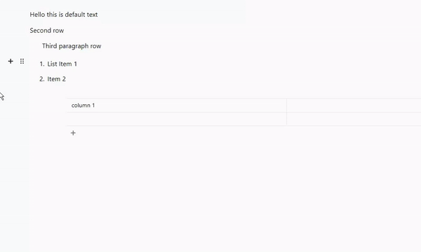

# Block indentation tune tool for Editor.js

You can add indentation to any block.



## How to use

1. Install

```shell
npm i editorjs-indent-tune
```

2. Connect tool

```js
import EditorJS from '@editorjs/editorjs'
import IndentTune from 'editorjs-block-indent-blocktune'

/**
 * Editor.js configuration
 */
const editor = new EditorJS({
    /**
     * Connect tool
     */
    tools: {
        indentTune: IndentTune,
    },

    /**
     * Apply to all the blocks
     */
    tunes: ['indentTune'],

    // ...
})
```

Optionally, you can connect this Tune only for specified blocks:

```js
const editor = new EditorJS({
    tools: {
        indentTune: IndentTune,
        paragraph: {
            // apply only for the 'paragraph' tool
            tunes: ['indentTune'],
        },
    },
})
```

You can disable this tune for a specific block by not adding it in the tunes array

```js
const editor = new EditorJS({
    tools: {
        someOtherTool: {
            //...
            tunes: [
                /* all other tunes except those you dont want*/
            ],
        },
    },
})
```

Complete example:

```js
import IndentTune, { type IndentTuneConfig } from 'editorjs-block-indent-blocktune'

const editor = new EditorJS({
    tools: {

        someOtherTool: {
            //...
        },
        indentTune: {
            class: IndentTune,
            config: {
                customBlockIndentLimits: {
                    someOtherTool: { max: 5 },
                },
                maxIndent: 10,
                indentSize: 30,
                multiblock: true,
                tuneName: 'indentTune',
                // If you use typescript
            } as Partial<IndentTuneConfig>,
        },
    },
})
```

## Config Params (optional)

| Field                   | Type                                                                 | Description                                                                          | Default      |
| ----------------------- | -------------------------------------------------------------------- | ------------------------------------------------------------------------------------ | ------------ |
| indentSize              | `number`                                                             | Size of one indent level (in pixels)                                                 | `24`         |
| maxIndent               | `number`                                                             | The upper indent limit of any block                                                  | `8`          |
| minIndent               | `number`                                                             | The lower indent limit of any block                                                  | `0`          |
| orientation             | `'horizontal' \| 'vertical'`                                         | The UI design for how you want the toolbox to be displayed                           | `horizontal` |
| customBlockIndentLimits | `Record<string, Partial<Record<'min' \| 'max', number>>>`            | A set of overrides of the indent limit for each type of block                        | `{}`         |
| multiblock              | `boolean`                                                            | If you can indent multiple blocks at a time                                          | `false`      |
| tuneName                | `string \| null`                                                     | This is required for multiblock to work                                              | `null`       |
| handleShortcut          | `((e:KeyboardEvent) => 'unindent' \| 'indent' \| void) \| undefined` | Custom shortcut function that allows overriding the default indenting using keyboard | `undefined`  |
